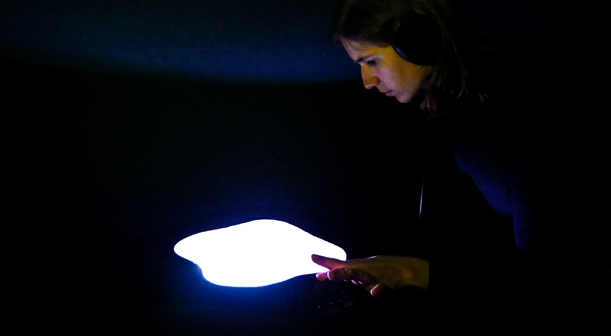
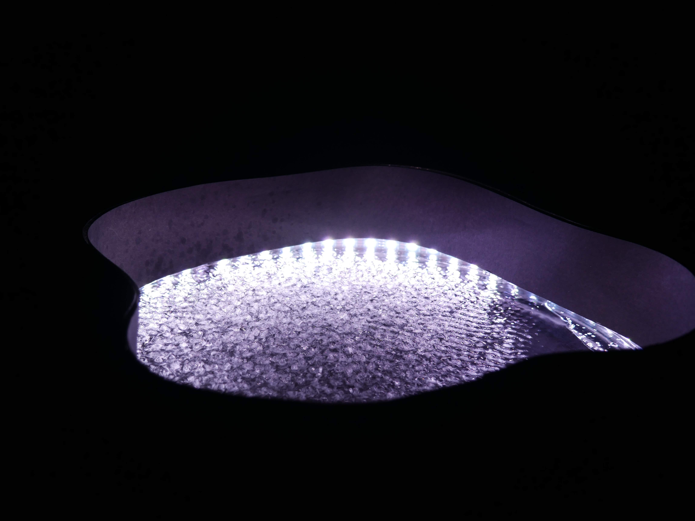
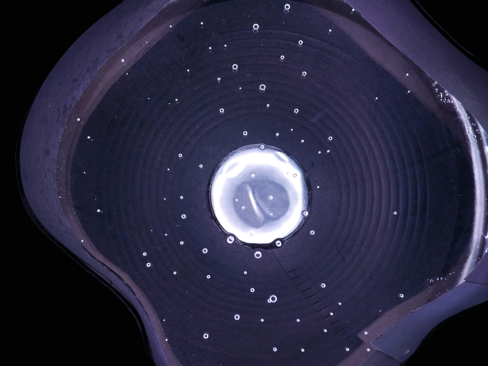
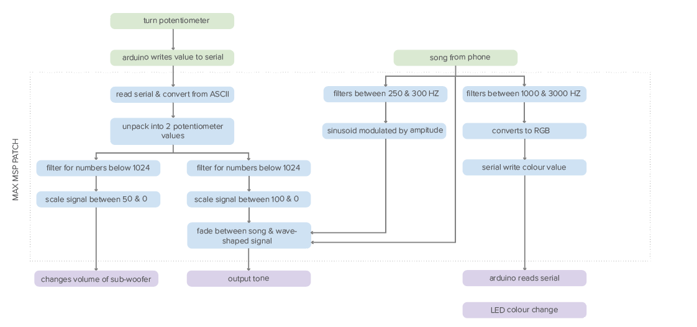
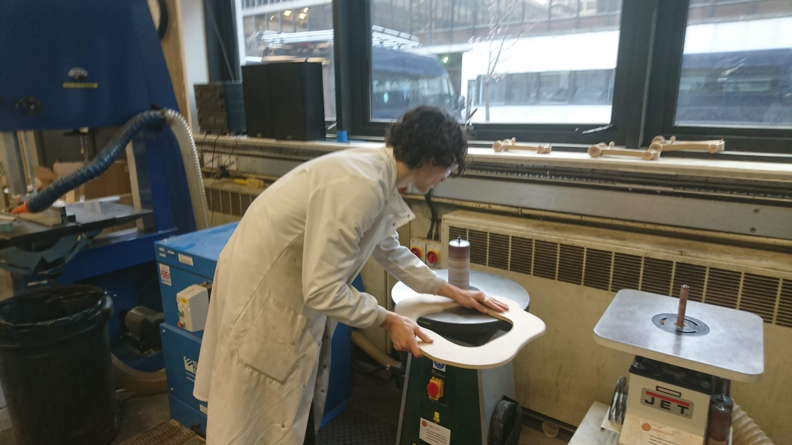
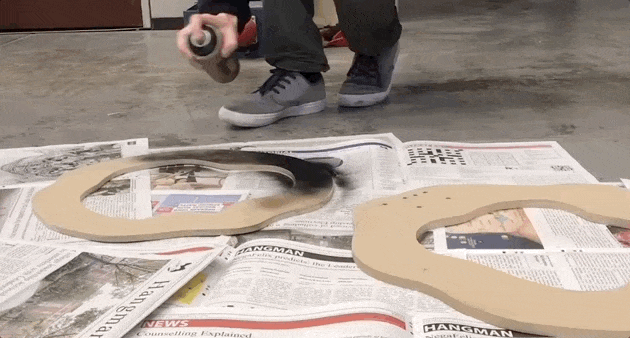

<p  align="center"></p>

<h1 align="center">
  Arena
</h1>

<p  align="center">
<sup>
  <a href="https://github.com/pa17">Paolo Rüegg, </a> 
  <a href="https://github.com/leahpattison">Leah Pattison, </a>
  <a href="https://github.com/ElliePeatman">Ellie Peatman, </a>
  <a href="https://github.com/omjh">Oliver Hoare, </a>  
  <a href="https://github.com/josephine-latreille">Josephine Latreille</a>
</sup>
</p>

<p  align="center">
<sup><sup>
  Dyson School of Design Engineering | Imperial College London | Audio Experience Design
</sup></sup>
</p>

**Arena** is an interactive cymatics installation that lets visitors discover how sound waves excite vibration patterns in liquids. It consists of two modules, one of which explores the effects of pure tones, and one that allows the visitor to play  their music on the apparatus. The generated patterns, known as Faraday waves, are a visualisation of the wealth of information contained in audio signals and are mesmerising and surprising alike. The installation was exhibited at the Dyson School of Design Engineering at Imperial College London on the 18th and 22nd of March 2019. 

<br>

## Gallery

<p align="center"></p>
<p align="center"></p>
<p align="center"></p>
<p align="center"></p>

## Contents

<details>
<summary style="font-size: medium">Background & Insipration</summary>

### Background & Inspiration

A Chladni plate visualises the standing waves generated at its natural resonating frequencies. The original experiment consists of fine particles (e.g. sand) that are dispersed on a steel plate. When it is excited with a bow or a loudspeaker,  the plate starts to resonate and the sand bounces from the oscillating antinodes to the stationary nodes. In mathematic terms, the nodes are the zero points of the plate's 2D wave equation at the excitation frequency. As the sand coalesces around these nodal lines of the standing wave, so-called Chladni figures become visible. They are shown below for a guitar backplate at its different resonating frequencies.

<p align="center"></p>
<p align="center"><em>Figure 1: Chladni Figures on a Guitar Body. <a href="https://commons.wikimedia.org/wiki/File:Chladni_guitar.svg">Source</a></em></p>

This effect can be extended to liquids that are placed on a vertically oscillating diaphragm. As a result, beautiful standing wave patterns emerge on the liquid as shown in the figure below. These patterns are known as Faraday waves. The morphology of the patterns is dependent on frequency and container geometries. Amplitude, on the other hand, does not change the form of standing wave. The project team decided to create an installation around these vibrational patterns generated in liquids. 

<p align="center"></p>
<p align="center"><em>Figure 2: Faraday waves. <a href="http://waterjournal.org/volume-9/sheldrake">Source</a></em></p>

</details>

<details>
<summary style="font-size: medium">Research</summary>

### Research

This initial phase aimed at testing different substrates and to quickly progress to a concept. The team tested ferrofluids, iron filings, vodka and various other substances on a bass reflex speaker (Figure 3). We also looked at previous installations, which were mostly focused on pure tones. The team showed interest in showcasing how different types of signals (simple, complex, static or dynamic) visualise on the apparatus.

<p align="center"></p>
<p align="center"><em>Figure 3: Faraday waves on a simple woofer</em></p>

</details>

<details>
<summary style="font-size: medium">Aims & Work Packages</summary>

### Aims & Work Packages

<!--
<details>
<summary style="font-size: medium">Aims & Work Packages</summary><br>
-->

The concept for *Arena* evolved from exploring the beautiful Faraday wave effect on a small woofer. The aim of the installation was to showcase the field of cymatics both bottom-up and top-down, i.e. with a pure tone and complex signal (music) approach. The team managed to source two 12'' drivers and, in line with this, aimed to build two modules with distinct aims:

* **Module 1** lets the visitor investigate the patterns generated by complex music signals. The visitor can input their own music through an AUX cable and control sound effects with rotary knobs. 

* **Module 2** lets the user investigate the patterns generated by sinusoids of varying frequency. The visitor can sweep through frequencies with a rotary knob.

Both modules would use Vodka as the liquid, as it was found to produce the most interesting patterns. The two concept sketches shown below outlined two potential layouts for the installation.

<p align="center"></p>
<p align="center"><em>Figure 4: Concept sketches</em></p>

My individual responsibilities were focused on *Module 1* and were delivered as three distinct work packages. The following sections are focused on my *individual contributions* to this project unless otherwise noted. All the code used during the installation is available [here](https://github.com/pa17/axp/tree/master/code).

* *WP1: System Design & Integration*: Designing the full system, sourcing the required audio components and connecting hardware to software
* *WP2: Sound Visualisation (Light)*: Developing and assembling an LED array that changes in color and brightness in response to varying amplitudes in defined frequency bins
* *WP3: Sound Processing*: Creating a Max MSP patch that processes music input through an AUX cable, crossfades between raw and waveshaped signals, and delivers an output signal to the driver (filtered) and headphones (raw)

Time planning for this project was rudimentary. The team's strategy was to source all components early on (W7 - W8), get individual tasks done in the following two weeks (W8 - W9), and to work together to integrate the subsystems in W10. 

</details>

<details>
<summary style="font-size: medium">WP1: System Design & Hardware Integration</summary>

### WP1: System Design & Hardware Integration

A clear system design was required to ensure the build would go smoothly. A full component decomposition is shown below for both modules, although I primarily designed the first module (shown on the left).

<p align="center"></p>
<p align="center"><em>Figure 5: System diagram with component decomposition for both modules</em></p>

A more detailed components breakdown is shown below for *Module 1*. Please note that all of these components are generic and can be replaced with any equivalent. As such, connectors such as cables are not specified here.

* 1x LEPY LP-202A Hi-Fi Stereo Power Amplifier (2 Channels, 20W RMS)
* 1x Focusrite Scarlett 2i2 Audio Interface (2 Channels)
* 1x Adafruit NeoPixel Digital RGB LED Strip (120 LEDs)
* 1x Arduino Uno R3
* 2x 12'' Radioshack speaker

The components were connected using a plethora of 3.5mm, 6.35mm and speaker cables. Data and power lines either ran through USB-A or jumper wires. The bulky electronic components were assembled on a piece of plywood and separated from the speaker, as shown in *Figure 6*. For the purposes of the installation, the electronics box was hidden away underneath a table upon which the module was placed.

<p align="center"></p>
<p align="center"><em>Figure 6: Hardware integration</em></p>

</details>

<details>
<summary style="font-size: medium">WP2: Sound Visualisation</summary>

### WP2: Sound Visualisation

This work package involved developing a color-changing equaliser with three frequency bins, where red, green & blue represented bass, midrange & highs. As such, a one-way data stream from Max MSP to a microcontroller was required, where music-dependent RGB values were serially transferred. On the Max side, the full signal was passed into two crossover objects (cross~), scaled and then sent to the microcontroller. The cut-off frequencies for the three frequency bands were chosen at 1000Hz and 3000Hz for bass-mid and mid-high, respectively. 

The patch shown below was introduced as a bpatcher object in the top-level Max patch, retaining toggling functionality to manually control RGB levels for debugging. Special thanks to @cskonopka and his [Arduivis project](https://github.com/cskonopka/arduivishttps://github.com/cskonopka/arduivis), some of the code of which was used to implement serialisation.

<p align="center"></p>
<p align="center"></p>
<p align="center"><em>Figure 7: LED Control and serialisation patch</em></p>

On the receiving end, the microcontroller interpreted the bytes as RGB values and controlled the LED strip through Adafruit's Neopixel library. The loop function is shown below. 

```
void loop() 
{

    // Slider from MaxMSP 
    int maxmspSlider1, maxmspSlider2, maxmspSlider3;

    // Parse incoming value from MaxMSP
    // -99 is a control value 
    if (Serial.parseInt() == -99){ 
        maxmspSlider1 = Serial.parseInt();  
        maxmspSlider2 = Serial.parseInt();  
        maxmspSlider3 = Serial.parseInt();  
    }

    // Set RGB values based on Max MSP values
    for(uint16_t i=0; i<strip.numPixels(); i++) {
        strip.setPixelColor(i  , strip.Color(maxmspSlider1, maxmspSlider2, maxmspSlider3)); // Draw new pixel
    }
    strip.show();

    delay(20);
}
```

In terms of hardware, a standard RGB LED strip was used and powered with a 5V / 10A power supply. Information about specific components can be found in the *WP1: Integration* section. The LED ring was run along the outer edge of the plate (*Figure 8*).

<p align="center"></p>
<p align="center"><em>Figure 8: LED ring assembly</em></p>

</details>

<details>
<summary style="font-size: medium">WP3: Sound Processing</summary>

### WP3: Sound Processing

The normalised input audio was passed into a crossfader object (M4L.cross1~), along with the waveshaped signal on the second input. Potentiometers actuated by the user informed output volume and the mixing between the raw and modified signal. User input and effect processing were not my responsibilities and are therefore not discussed further here. Instead, I worked on I/O, implemented the crossfading and matched hardware and software channels. The full software diagram for *Module 1* is shown here for completeness.

<p align="center"></p>
<p align="center"><em>Figure 9: Functional flowchart of Max patch</em></p>

A problem that quickly became apparent was that the loudness of the subwoofer was excessive considering two modules were playing at the same time. During the installation, the signal to the subwoofer was therefore filtered using a biquad~ object, at a cutoff frequency of 120 Hz. The filtered sub and the unfiltered headphone mono signals were sent to individual DAC outputs on the audio interface.

<p align="center"></p>
<p align="center"><em>Figure 10: Crossfader and filtering patch</em></p>

</details>

<details>
<summary style="font-size: medium">Build</summary>

### Build

A wooden top piece with an organic curvature was manufactured to overlay the subwoofer. The knobs were attached along with a wooden frame to hold the structure. The frame could subsequently be placed over the subwoofer, with the electronics tucked away underneath the presentation table. The final piece is shown in the gallery on top for presentation reasons. 

<p align="center"></p>
<p align="center"></p>
<p align="center"><em>Figure 10: Manufacturing and painting the top pieces</em></p>

</details>

<details>
<summary style="font-size: medium">Review & Future Improvements</summary>

### Review & Future Improvements

The installation was a success with the biggest response being amazement at the complexity of patterns produced. It was noted how a relatively simple apparatus could create complex nonlinear behaviours. Moreover, people appeared to like the fact that they could play their own music, somewhat giving them a new experience of music they already have an emotional attachment to. Other successes included:

- [x] Tightness of seal through use of acetyl welding
- [x] Good results with different mobile phones through signal normalisation
- [x] Visitors took their time to experience the installation and usually tried more than one song

Limitations included the meaningfulness of the interactions and the loudness of the installation. The former suffered from the fact that the team struggled to 'decompose' a music track into fewer yet consonant signals. The loudness of the installation was another drawback, especially as the sound seeped through to the other module, sometimes causing Faraday waves on it when only one was playing. Other limitations included:

* Average build quality due to time constraints
* Considerable difficulty in transporting and reassembling the installation
* Performance issues related to serial connections to Arduino
* Liquid evaporated over time and needed to be refilled repeatedly

This project was conducted over the limited time frame of a month along with various other deadlines. As a result, many corners were cut and future work should start with a rework of already existing building blocks such as:

- [ ] Devising a better cable management strategy
- [ ] Using plugs rather than soldered connections
- [ ] Making serial connection more robust

On top of that, interactions should be overhauled. FFT-based peak decomposition with narrow frequency bins could be very interesting to isolate the highest amplitude frequencies and demonstrate how these can cause Faraday waves. Personally, I would be interested in miniaturising the installation into a smaller yet fully sealed container.

</details>

### License

The source code is licensed under [GNU General Public License v3.0](LICENSE)

<a rel="license" href="http://creativecommons.org/licenses/by-sa/4.0/"></a><br />This work is licensed under a <a rel="license" href="http://creativecommons.org/licenses/by-sa/4.0/">Creative Commons Attribution-ShareAlike 4.0 International License</a>.